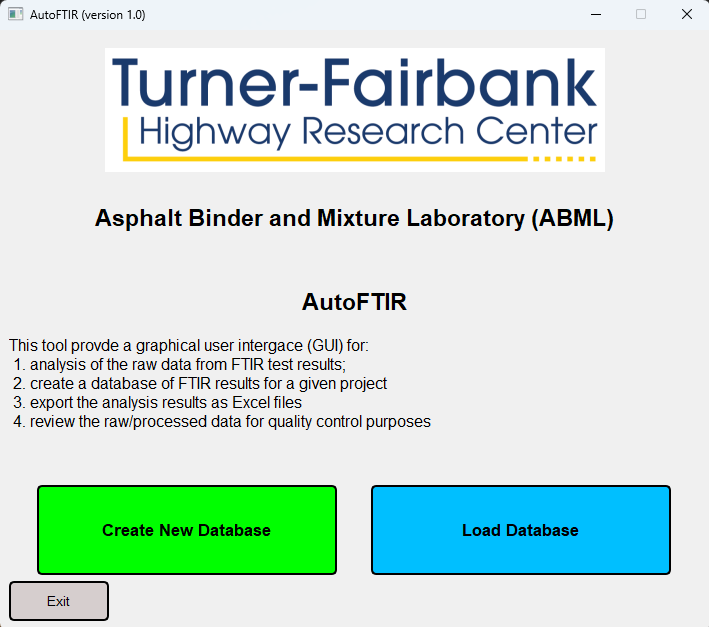
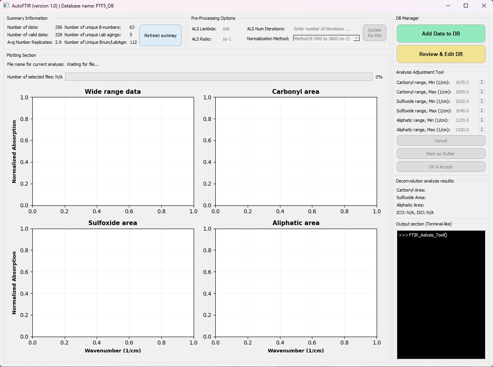
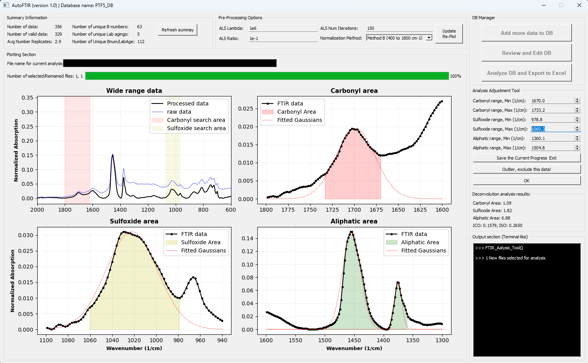

# AutoFTIR

[](https://github.com/TFHRC-ABML/AutoFTIR/blob/main/LICENSE)

**[paper](XXXX)**

Authors and Contributors:
- *S. Farhad Abdollahi (farhad.abdollahi.ctr@dot.gov)*
- *Behnam Jahangiri (behnam.jahangiri.ctr@dot.gov)*
- *Adrian Anderiescu (adrian.anderiescu.ctr@dot.gov)*
- *Aaron Leavitt (aaron.leavitt@dot.gov)*
- *David Mensching (david.mensching@dot.gov)*


This repository contains the official implementation of the **"AutoFTIR"**.

The **AutoFTIR** is a user-friendly Graphical User Interface (GUI) developed in Python to assist pavement engineers in analyzing the results of Fourier Transform Infrared (FTIR) spectroscopy on asphalt binders. The tool offers the following key features:

- **Data Preprocessing**: Process raw FTIR spectra by applying baseline correction using the Asymmetric Least Squares (ALS) Smoothing method, followed by normalization of the largest peak to 0.15 within the wavenumber range of 600 to 1800 cm⁻¹.

- **Deconvolution Analysis**: Perform deconvolution analysis by fitting Gaussian functions to distinct peaks in the FTIR spectra and calculating the corresponding carbonyl and sulfoxide indices.

- **Peak Recognition Facilitator**: Provide an intuitive GUI framework to streamline the identification of peaks in the carbonyl, sulfoxide, and aliphatic functional group regions.

- **Database Management**: Store analysis results and preprocessed spectra in an SQLite3 database, enabling organization by binder replicates, binder types, and aging levels.

## Content ##

0. [Setup Instrcution](#setup-instruction)
0. [Sample Dataset](#sample-database)
0. [How to Use](#how-to-use)
0. [Acknowledgement](#acknowledgement)
0. [Citation](#citation)


## Setup Instruction ##

### Requirement:

To run this project, you'll need to have [Conda](https://docs.conda.io/en/latest/miniconda.html) (Miniconda or Anaconda) installed in your computer. 

---

### Step 1: Install Conda
Ensure you have Conda installed on your system. You can download and install it from the [Miniconda](https://docs.conda.io/en/latest/miniconda.html) or [Anaconda](https://www.anaconda.com/) website.

---

### Step 2: Clone the Repository

Clone this repository to your local machine:

```bash
git clone https://github.com/TFHRC-ABML/AutoFTIR.git
cd FTIR_Analysis_Tool
```

---

### Step 3: Setup Python environment

1. Ensure the `environment.yml` file is in the project directory, under `./configs/environment.yml`.

2. Create a new Conda environment using the provided YAML file:

```bash
conda env create --file ./configs/environment.yml
```

3. Activate the environment:

```bash
conda activate ftir
```

---

### Step 4: Run the program 

To run the program, execute the following command:

```bash
python Main_GUI.py
```

## Sample Database ##

As an example, a database containing 329 FTIR test results for 54 different asphalt binders under various aging 
conditions is provided at `./example/PTF5_DB.db`. In this database:

* Each asphalt binder is identified by a B-number (a four-digit identification number).
* The database includes details of the laboratory aging process and repetition numbers.
* A column labeled "IsOutlier" tracks data points that are considered outliers, such as noisy measurements or those that deviate from the trends of other replicates.

The dataset contains both **Original** asphalt binders sourced from asphalt plants and **Extracted** asphalt binders obtained from various asphalt mixtures with different percentages of RAP content (0%, 20%, and 40%). Additionally, the dataset includes SBS-modified and rejuvenated asphalt binders. Users can either create their own database or load the provided example database to start working with the software.

When creating or loading a database, users can add FTIR test results to perform the required analysis. To do so, the FTIR spectrum must be provided as a `*.dpt` file. This file should be a text-based, two-column, comma-delimited format containing:
1. Wavenumbers (in cm⁻¹)
2. Absorbance values of the asphalt binder samples

The file must cover at least the wavenumber range of 550 to 1850 cm⁻¹. Example input `*.dpt` files are included in the project, such as `./example/B7042_FTIR_Rep1_1PAV.dpt`.

## How to Use ##

Upon running the code, the user should accept the "Terms of Use and Agreement", and then directed to the welcome page (see [Figure 1](#fig-welcome)). Here, user can either create a new database or load one. You may load the `./example/PTF5_DB.pd` database, which was provided with the package. 

<a id="fig-welcome"></a>
<p align="center">
  
</p>
<p align="center"><b>Figure 1:</b> Welcome Page</p>

The main page (see [Figure 2](#fig-main-nodata)) appears after loading the database. User can use the "Add more data to DB" button to select more `*.dpt` files to analyze and add them to the database. 

<a id="fig-main-nodata"></a>
<p align="center">
  
</p>
<p align="center"><b>Figure 2:</b> Main Page (No Data Loaded)</p>


By selecting each `*.dpt` file, it is loaded into the main page as shown in [Figure 3(#fig-main-data)]. The deconvolution analysis method is ran by default and the results are available at the middle right group box. The peaks for carbonyl, sulfoxide, and aliphatic functional groups were also autmoatically detected and showed as highlighted regions in the corresponding graphs. However, it is noted that this peak recognition algorithms is not fully reliable and the user should trim the peak boundaries using the sping boxes in the right group box in the main page. 

<a id="fig-main-data"></a>
<p align="center">
  
</p>
<p align="center"><b>Figure 3:</b> Main Page (Data Loaded)</p>

Use the "Add more data to DB" button to select the "*.dpt" files. Each spectrum will be shown and the user can change the Carbonyl, Sulfoxide, and Aliphatic boundaries for the peak recognition analysis methods. The deconvolution analysis method will be already imeplemented. The user can then decide to accept the results or label them as outlier. The results will be stored in the connected database. 

User can use the "Review and Edit DB" button to review all test results in the database, and edit the analysis. The user can also combine all replicates of the same binder spectra and export the results using the "Analyze DB and Export to Excel" button. 

## Acknowledgement ##

We sincerely thank Bethel La Plana and Steve Portillo for their efforts in preparing aged asphalt binder samples and conducting FTIR testing, Scott Parobeck and Frank Davis for handling asphalt mixtures and extractions, and Adrian Andriescu for their invaluable support throughout the project.

## Citation ##

If you use our code or method in your work, please consider citing the following:

```bibtex
@misc{AbdollahiFTIRAnalysisTool2025,
  title = {Development of an Automated FTIR Analysis Framework for Asphalt Binders Using Asymmetric Least Squares Smoothing and Deconvolution},
  author = {Abdollahi, Seyed Farhad and Jahangiri, Behnam, Andriescu, Adrian, Leavitt, Aaron and Mensching, David},
  year = {TBD},
  month = XX,
  publisher = {Road Materials and Pavement Design},
  doi = {XXXXX},
  urldate = {2024-10-09},
  archiveprefix = {XXX},
  langid = {english},
  keywords = {FTIR,asphalt binder,deconvolution,oxidation,aging,RTFO,PAV,pavement testing facility,recycling agents,AutoFTIR}
}
```

Please direct any questions to Farhad Abdollahi (farhad.abdollahi.ctr@dot.gov).